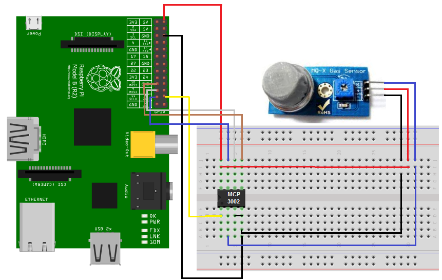

#! README.MD

NodeJS app in Raspberry Pi for [evasap](https://github.com/haritsE/evasap), an app for Hackathon Merdeka 2.0.

# Installation

## Schematic



## Installing spidev:

```
sudo apt-get update
sudo apt-get -y install git python-dev
git clone https://github.com/doceme/py-spidev.git
cd py-spidev/
sudo python setup.py install
```
## Node Modules

```
npm i --python=python2
```

# Usage

```
node index.js
```

# Credits

Python script for smoke detection is acquired from
http://www.learningaboutelectronics.com/Articles/MQ-2-smoke-sensor-circuit-with-raspberry-pi.php
